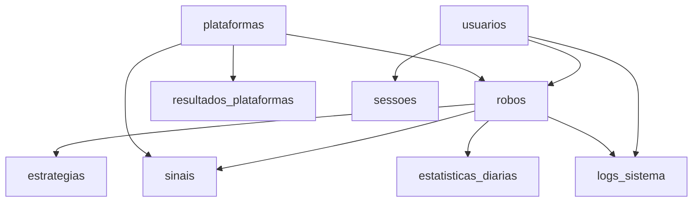

# 🗄️ BANCO DE DADOS SUPABASE - DOCUMENTAÇÃO

## 📋 **VISÃO GERAL**

Este sistema utiliza **Supabase** como banco de dados principal para armazenar:
- 👤 **Usuários** e autenticação
- 🤖 **Robôs** multi-usuário
- 🎯 **Estratégias** personalizadas
- 📊 **Resultados** das plataformas de apostas
- 🎯 **Sinais** enviados pelos robôs
- 📝 **Logs** do sistema
- ⚙️ **Configurações** globais

---

## 🚀 **CONFIGURAÇÃO INICIAL**

### **1. Criar Projeto no Supabase**
```bash
1. Acesse https://supabase.com
2. Crie uma nova conta ou faça login
3. Clique em "New Project"
4. Escolha um nome e senha para o banco
5. Aguarde a criação do projeto
```

### **2. Obter Chaves de API**
```bash
1. Vá em Settings > API
2. Copie as seguintes informações:
   - Project URL
   - anon public (chave pública)
   - service_role (chave privada)
```

### **3. Executar Scripts SQL**
```bash
1. Vá em SQL Editor no painel do Supabase
2. Copie todo o conteúdo de 'database_supabase.sql'
3. Cole no editor e execute
4. Aguarde a criação de todas as tabelas
```

### **4. Configurar Variáveis de Ambiente**
```bash
# Copie o arquivo de exemplo
cp .env.exemplo .env

# Edite o arquivo .env com suas chaves
SUPABASE_URL=https://seu-projeto.supabase.co
SUPABASE_ANON_KEY=sua-chave-publica
SUPABASE_SERVICE_KEY=sua-chave-privada
```

---

## 📊 **ESTRUTURA DO BANCO**

### **🗂️ TABELAS PRINCIPAIS**

| Tabela | Descrição | Registros |
|--------|-----------|-----------|
| `usuarios` | Controle de usuários e planos | Multi-usuário |
| `robos` | Configuração dos robôs | Por usuário |
| `estrategias` | Estratégias personalizadas | Por robô |
| `plataformas` | Casas de apostas suportadas | Global |
| `resultados_plataformas` | Dados coletados das APIs | Histórico |
| `sinais` | Sinais enviados pelos robôs | Por robô |
| `logs_sistema` | Logs detalhados | Sistema |
| `configuracoes_sistema` | Configurações globais | Admin |
| `sessoes` | Controle de autenticação | Por usuário |
| `estatisticas_diarias` | Métricas por dia | Por robô |

### **🔗 RELACIONAMENTOS**



---

## 👤 **GESTÃO DE USUÁRIOS**

### **Tipos de Planos**
- 🆓 **Free**: 1 robô, 50 sinais/dia
- 💎 **Premium**: 5 robôs, 200 sinais/dia  
- 👑 **VIP**: 20 robôs, 1000 sinais/dia
- 🔧 **Admin**: Sem limites

### **Campos Principais**
```sql
-- Tabela usuarios
id UUID PRIMARY KEY
email VARCHAR(255) UNIQUE
nome VARCHAR(100)
plano VARCHAR(20) -- free, premium, vip, admin
status VARCHAR(20) -- ativo, inativo, suspenso
max_robos INTEGER
max_sinais_dia INTEGER
telegram_user_id BIGINT
configuracoes JSONB
```

---

## 🤖 **SISTEMA DE ROBÔS**

### **Configuração por Robô**
```json
{
  "max_gales": 2,
  "intervalo_segundos": 3,
  "confianca_minima": 75,
  "max_sinais_dia": 20,
  "protecao_branco": true,
  "alertas_ativos": true
}
```

### **Mensagens Personalizadas**
```json
{
  "entrada": "🎯 SINAL: [SINAL] | [NOME_ESTRATEGIA]",
  "win": "✅ GREEN [TIPO_GREEN_MAIUSCULO]",
  "loss": "❌ RED | Próximo sinal em breve"
}
```

### **Estatísticas em Tempo Real**
```json
{
  "sinais_enviados": 45,
  "wins": 32,
  "losses": 13,
  "wins_sem_gale": 20,
  "wins_por_gale": {"G1": 8, "G2": 4},
  "ganhos_consecutivos": 3,
  "ultima_atividade": "2025-01-25T15:30:00Z"
}
```

---

## 🎯 **ESTRATÉGIAS E SINAIS**

### **Formato de Estratégias**
```sql
-- Exemplo: Dois vermelhos → apostar no preto
pattern: "V-V"
bet: "P"
confianca: 75
```

### **Registro de Sinais**
```sql
-- Cada sinal registrado contém:
robo_id UUID
estrategia_id UUID  
plataforma_id VARCHAR
sinal VARCHAR(10) -- V, P, B
confianca INTEGER
status VARCHAR -- pendente, win, loss
gales_utilizados INTEGER
timestamp_sinal TIMESTAMP
timestamp_resultado TIMESTAMP
```

---

## 📊 **COLETA DE DADOS DAS PLATAFORMAS**

### **Plataformas Suportadas**
- 🔥 **Blaze Double**
- 🎯 **Jonbet Double**  
- 🔥 **Betfire Double**

### **Formato dos Resultados**
```json
{
  "plataforma_id": "blaze",
  "resultado": "14",
  "numero": 14,
  "cor": "preto",
  "timestamp_plataforma": "2025-01-25T15:45:30Z",
  "dados_completos": {
    "roll": 14,
    "color": "black",
    "created_at": "2025-01-25T15:45:30.123Z"
  }
}
```

---

## 🔐 **SEGURANÇA E AUTENTICAÇÃO**

### **Row Level Security (RLS)**
- ✅ **Habilitado** em todas as tabelas principais
- 🔒 **Políticas** por usuário
- 🛡️ **Isolamento** completo de dados

### **Políticas de Acesso**
```sql
-- Usuários só veem seus próprios dados
CREATE POLICY usuarios_select_own ON usuarios
    FOR SELECT USING (auth.uid() = id::text::uuid);

-- Robôs isolados por usuário
CREATE POLICY robos_all_own ON robos
    FOR ALL USING (auth.uid() = usuario_id::text::uuid);
```

### **Autenticação JWT**
- 🔑 **Tokens** seguros com expiração
- 🔄 **Refresh** automático
- 📱 **Multi-dispositivo**

---

## 📈 **MONITORAMENTO E LOGS**

### **Níveis de Log**
- 🐛 **DEBUG**: Informações detalhadas
- ℹ️ **INFO**: Eventos normais
- ⚠️ **WARNING**: Alertas importantes
- ❌ **ERROR**: Erros recuperáveis
- 🚨 **CRITICAL**: Erros críticos

### **Categorias**
- 🤖 **bot**: Operações dos robôs
- 🎯 **estrategia**: Análise de estratégias
- 📡 **telegram**: Envios para Telegram
- 🎰 **plataforma**: Coleta de dados
- 🔐 **auth**: Autenticação
- ⚙️ **sistema**: Operações gerais

---

## 🛠️ **MIGRAÇÃO DE DADOS**

### **Migração Automática**
```bash
# Migrar dados locais para Supabase
python migracao_supabase.py

# Opções disponíveis:
1. Migração completa (JSON → Supabase)
2. Gerar dados de teste
3. Verificar migração
```

### **Dados Migrados**
- ✅ **Robôs** configurados localmente
- ✅ **Estratégias** personalizadas
- ✅ **Resultados** coletados das plataformas
- ✅ **Configurações** do sistema

---

## ⚡ **PERFORMANCE E OTIMIZAÇÃO**

### **Índices Criados**
```sql
-- Índices para queries frequentes
CREATE INDEX idx_robos_usuario_status ON robos(usuario_id, status);
CREATE INDEX idx_sinais_robo_timestamp ON sinais(robo_id, timestamp_sinal DESC);
CREATE INDEX idx_resultados_plataforma_timestamp ON resultados_plataformas(plataforma_id, timestamp_plataforma DESC);
CREATE INDEX idx_logs_timestamp_nivel ON logs_sistema(timestamp DESC, nivel);
```

### **Views Otimizadas**
- 📊 `dashboard_usuario`: Resumo por usuário
- 📈 `estatisticas_robos`: Performance dos robôs
- 🎯 `sinais_recentes`: Últimos sinais enviados

---

## 🔧 **FUNÇÕES ÚTEIS**

### **Calcular Estatísticas**
```sql
-- Função para calcular stats de um robô
SELECT calcular_estatisticas_robo('uuid-do-robo');
```

### **Triggers Automáticos**
- ⏰ **update_timestamp**: Atualização automática de timestamps
- 📊 **calcular_stats**: Recálculo de estatísticas
- 🔄 **log_changes**: Log de alterações importantes

---

## 📋 **EXEMPLOS DE QUERIES**

### **Dashboard do Usuário**
```sql
SELECT * FROM dashboard_usuario WHERE usuario_id = 'user-uuid';
```

### **Sinais do Dia**
```sql
SELECT 
    s.*,
    e.nome as estrategia_nome,
    r.nome as robo_nome
FROM sinais s
JOIN estrategias e ON s.estrategia_id = e.id
JOIN robos r ON s.robo_id = r.id
WHERE DATE(s.timestamp_sinal) = CURRENT_DATE
  AND r.usuario_id = 'user-uuid'
ORDER BY s.timestamp_sinal DESC;
```

### **Performance por Estratégia**
```sql
SELECT 
    e.nome,
    COUNT(s.id) as total_sinais,
    COUNT(CASE WHEN s.status = 'win' THEN 1 END) as wins,
    ROUND(
        COUNT(CASE WHEN s.status = 'win' THEN 1 END)::DECIMAL / 
        COUNT(s.id) * 100, 2
    ) as assertividade
FROM estrategias e
LEFT JOIN sinais s ON e.id = s.estrategia_id
WHERE e.robo_id = 'robo-uuid'
GROUP BY e.id, e.nome
ORDER BY assertividade DESC;
```

---

## 🎯 **PRÓXIMOS PASSOS**

### **Após Configurar o Banco**
1. ✅ Execute o SQL completo no Supabase
2. ✅ Configure o arquivo `.env` 
3. ✅ Execute a migração de dados
4. ✅ Teste a conexão com `python supabase_config.py`
5. ✅ Inicie o admin backend

### **Integração com o Sistema**
- 🔄 **Backend**: Utilizará `DatabaseManager` automaticamente
- 🌐 **Admin Web**: Interface para gerenciar via browser
- 🤖 **Executor**: Sistema principal utilizará o Supabase
- 📊 **Análises**: Painéis com dados em tempo real

---

## 🎉 **VANTAGENS DO SUPABASE**

- ⚡ **Performance**: Banco PostgreSQL otimizado
- 🔐 **Segurança**: RLS nativo e autenticação integrada
- 🌍 **Escalabilidade**: Suporta milhares de usuários
- 🔄 **Real-time**: Atualizações em tempo real
- 📊 **Dashboard**: Interface visual para administração
- 🆓 **Custo**: Plano gratuito generoso
- 🔧 **APIs**: REST e GraphQL automáticas
- 📱 **Multi-plataforma**: Web, mobile, desktop

**Seu sistema agora está pronto para funcionar como um SaaS profissional! 🚀** 